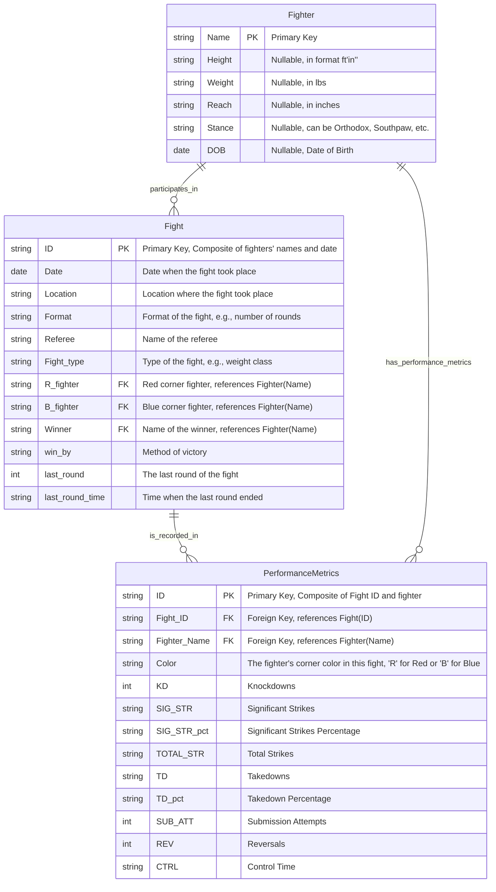

# UFC Database Application

## Project Overview
This Python application allows users to interact with a UFC (Ultimate Fighting Championship) database. Users can load raw fight data into a SQLite database and execute predefined SQL queries to analyze fighter statistics and match outcomes.

## Features
- Load data from CSV files into a SQLite database.
- Execute predefined SQL queries for data analysis.
- User-friendly interface for running queries and viewing results.

## Prerequisites
- Python 3.x
- pandas library
- sqlite3 library

Ensure you have Python installed on your system. You can install the required Python libraries using pip:

```bash
pip install pandas sqlite3
```

## Installation
Clone the repository to your local machine:

```bash
git clone https://github.com/adrianoamalfi/ufc.git
cd ufc
```

## Usage
1. Place your `raw_fighter_details.csv` and `raw_total_fight_data.csv` files in the same directory as the script.
2. Load data:

```bash
python 4_load_data.py
```

3. Run the application:

```bash
python 5_query_interface.py
```

3. Follow the on-screen instructions to interact with the database and execute queries.

## Available Queries
1. Show the top 10 fighters with the most fights.
2. Show average significant strike percentages by corner color.
3. Show the top 10 fighters with the most wins.
4. Show the top 10 fight types by average last round duration.

## Entity-Relationship Diagram (ERD)
The ERD illustrates the database schema and the relationships between tables.

### Mermaid Format
To view the ERD in Mermaid format, check the `ERD.mermaid` file in this repository.



### PNG Format
[ERD PNG](ERD.png)

## Contributing
Contributions to the UFC Database Application are welcome! Please ensure that your pull requests provide a clear description of what they add or fix.

## License
[MIT](https://choosealicense.com/licenses/mit/)

## Acknowledgements
This project was inspired by the rich dataset provided by the UFC and aims to provide meaningful insights into fight statistics and outcomes.